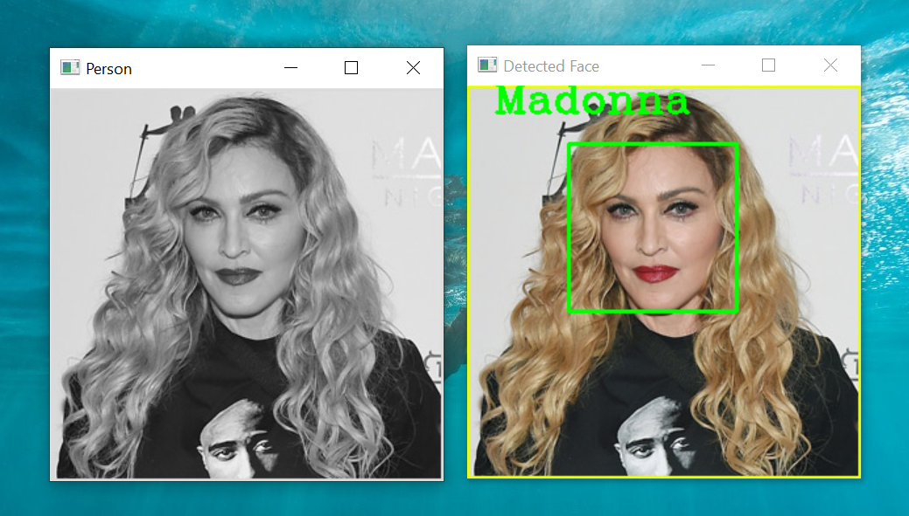

# Face Recognition Using Opencv
### _Face Detection using Haar Cascades and OpenCV's LBPHFaceRecognizer algorithm._<br><br>
To run the project install opencv-contrib-python using pip:

```
pip install opencv-contrib-python
```
Clone the repo:
```
git clone https://github.com/sakshijain009/face_recognition_haar_cascade.git
```
To train the model, run the following command:
```
python faces_train.py
```
This will create the trained yaml file which will be used for recognition. To predict the images run the following command:
```
python face_recognition.py
```
<br>
To test we can use any image <b>Faces/val/</b>. On recognition this is how it is displayed:

